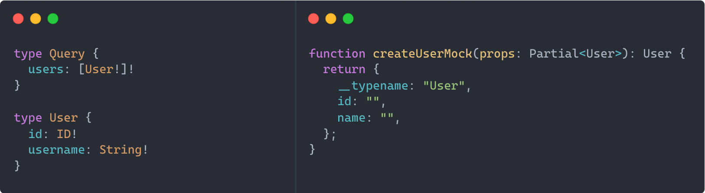

# graphql-codegen-factories

  

`graphql-codegen-factories` is a plugin for [graphql-code-generator](https://www.graphql-code-generator.com/) that generates factories based on a GraphQL schema. Those factories can then be used to create objects that match the schema, for example to mock data in tests or to seed a database.



- [Usage](#usage)
- [Examples](#examples)
- [How to](#how-to)
- [Documentation](#documentation)
- [Changelog](#changelog)
- [License](#license)
- [Contributors](#contributors)

## Usage

Install the plugin:

```sh
npm install --save-dev graphql-codegen-factories
```

Add it to your `codegen.yml` configuration file:

```yml
overwrite: true
schema: ./schema.graphql
generates:
  ./types.ts:
    plugins:
      - typescript
      - graphql-codegen-factories
```

## Examples

- Demo: [Code](./packages/demo) / [Open in StackBlitz](https://stackblitz.com/github/zhouzi/graphql-codegen-factories/tree/main/packages/demo?file=/src/schema.graphql)

## How to

<details>
<summary>How can I use it with <code>near-operation-file-preset</code>?</summary>

By default the plugin only generates factories based on the schema. To generate factories for operations, you need to use the `graphql-codegen-factories/operations` entry point.

```yml
overwrite: true
schema: ./schema.graphql
documents: ./src/**/*.graphql
generates:
  ./src/types.ts:
    plugins:
      - typescript
      - graphql-codegen-factories
  ./src/:
    preset: near-operation-file
    presetConfig:
      extension: .generated.ts
      baseTypesPath: types.ts
    plugins:
      - typescript-operations
      - graphql-codegen-factories/operations
```

</details>

## Documentation

- [`config.factoryName`](#configfactoryName)
- [`config.scalarDefaults`](#configscalarDefaults)
- [`config.typesPath`](#typesPath)
- [`config.importTypesNamespace`](#importTypesNamespace)

### `config.factoryName`

By default, this plugin generates factories named `create{Type}Mock`.
So for a type `Author`, the corresponding factory will be named `createAuthorMock`.

Here's an example of how you can change that to `newAuthor`:

```yml
overwrite: true
schema: ./schema.graphql
generates:
  ./types.ts:
    plugins:
      - typescript
      - graphql-codegen-factories
    config:
      factoryName: new{Type}
```

### `config.scalarDefaults`

This plugin is able to provide useful defaults for the built-in scalars but it falls short for your custom ones.
In this case, you will have to provide the plugin the desired default value.

For example, let's say you have declared a `scalar Date`, here's how you can provide the default value to be used when the plugin finds it:

```yml
overwrite: true
schema: ./schema.graphql
generates:
  ./types.ts:
    plugins:
      - typescript
      - graphql-codegen-factories
    config:
      scalarDefaults:
        Date: new Date()
```

Note that you can also override the default values for the built-in scalars.
For example, this plugin defaults `Boolean` to `false` but you can change the default to `true` as follows:

```yml
overwrite: true
schema: ./schema.graphql
generates:
  ./types.ts:
    plugins:
      - typescript
      - graphql-codegen-factories
    config:
      scalarDefaults:
        Boolean: true
```

### `config.typesPath`

By default the generated factories assume that the types are in the same file. If you want to have separate files, for example `types.ts` with the types and `factories.ts` for the factories, you need to provide the path to `config.typesPath`.

```yml
overwrite: true
schema: ./schema.graphql
generates:
  ./types.ts:
    plugins:
      - typescript
  ./factories.ts:
    plugins:
      - graphql-codegen-factories
    config:
      typesPath: ./types
```

### `config.importTypesNamespace`

With `config.typesPath`, an import statement is preprended to the factories file:

```typescript
import * as Types from "./types";
```

By default types are imported as `Types` but you can customize it by providing another name to `config.importTypesNamespace`.

```yml
overwrite: true
schema: ./schema.graphql
generates:
  ./types.ts:
    plugins:
      - typescript
  ./factories.ts:
    plugins:
      - graphql-codegen-factories
    config:
      typesPath: ./types
      importTypesNamespace: SharedTypes
```

## Changelog

[Changelog](./changelog.md)

## License

[MIT](./license)

## Contributors

[](https://github.com/zhouzi) [](https://github.com/ertrzyiks)
